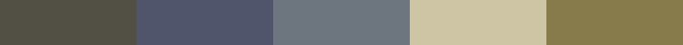
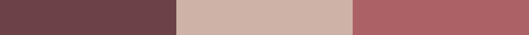

<!DOCTYPE html>
<html><body>
<h1>Nolde</h1>

Click on the color palette to see the original artwork!

<table style="width:100%">
<tr><th style="text-align: center; vertical-align: middle;">ID</th><th style="text-align: center; vertical-align: middle;">Palette</th><th style="text-align: center; vertical-align: middle;">Hex Palette</th></tr>
<tr><td style="text-align: center; vertical-align: middle;">
BCFEAEFB571EFEC896D2
</td> <td style="text-align: center; vertical-align: middle;"></td> <td style="text-align: center; vertical-align: middle;">
#2C2B28, #514B41, #6F5E4E, #74756A, #878D7C, #A6744D
</td></tr>
<tr><td style="text-align: center; vertical-align: middle;">
01A13621F5CD4183728D
</td> <td style="text-align: center; vertical-align: middle;"></td> <td style="text-align: center; vertical-align: middle;">
#CCC89E, #EACB49, #11407A, #3268C2, #77A4CB
</td></tr>
<tr><td style="text-align: center; vertical-align: middle;">
421D8997497566F4FFF2
</td> <td style="text-align: center; vertical-align: middle;"></td> <td style="text-align: center; vertical-align: middle;">
#1D2830, #25576D, #3F697B, #909A97
</td></tr>
<tr><td style="text-align: center; vertical-align: middle;">
B3705BE121F10E762871
</td> <td style="text-align: center; vertical-align: middle;"></td> <td style="text-align: center; vertical-align: middle;">
#1A1C1F, #245870, #8A8774, #D0DDD2, #F0B621, #DB6724, #72242B, #EBDA8B
</td></tr>
<tr><td style="text-align: center; vertical-align: middle;">
67A4B7FBFE31A162A288
</td> <td style="text-align: center; vertical-align: middle;"></td> <td style="text-align: center; vertical-align: middle;">
#322525, #413B3D, #645C55, #8E7C6E, #7D5F2F
</td></tr>
<tr><td style="text-align: center; vertical-align: middle;">
3C0EC8D9C126AB054508
</td> <td style="text-align: center; vertical-align: middle;"></td> <td style="text-align: center; vertical-align: middle;">
#525045, #50556B, #6D757E, #CEC5A5, #877B4D
</td></tr>
<tr><td style="text-align: center; vertical-align: middle;">
B9068CC3AA2E9F8AE305
</td> <td style="text-align: center; vertical-align: middle;"></td> <td style="text-align: center; vertical-align: middle;">
#6C4247, #CFB2A7, #AC6167
</td></tr>
</table>
</body></html>
